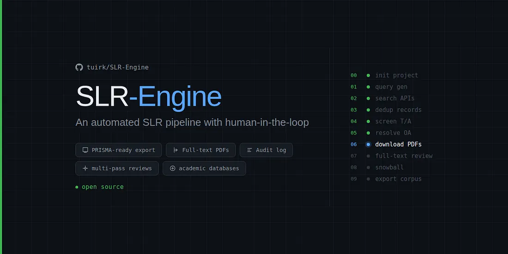
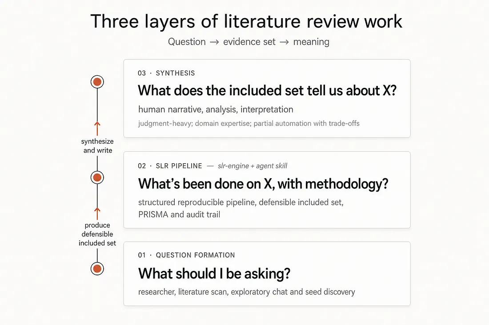
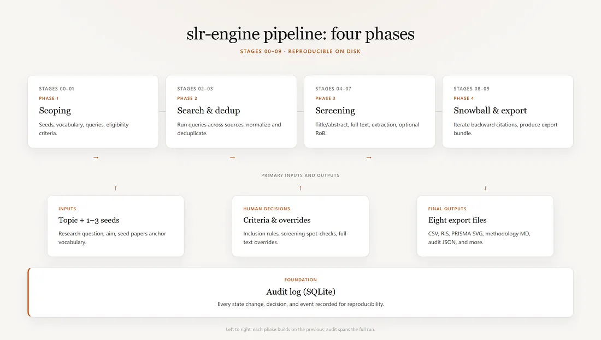
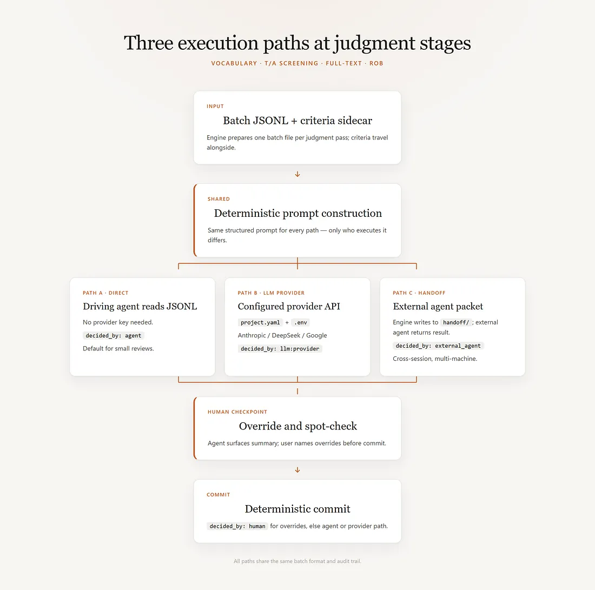

# Introduction to SLR-Engine (plain-language guide)

## Overview

A **systematic literature review (SLR)** is a structured method to find, screen, and summarize published research on a specific question using explicit search strategies and documented criteria.

The aim of **SLR-Engine** is to give anyone with a topic they want to explore — students and self-learners, researchers, business and consulting teams with a research question — an easy, lightweight way to do it, grounded in academic papers.

*Less time, less effort, no methodology background required,* but built on the same proven methodology that researchers around the world use.

**SLR-Engine** runs a sequence off PRISMA-aligned stages each doing one job and writing its results to disk so work can be picked up where it left off. A **coding agent**; one that can run code, call APIs, and access the internet, drives the conversation and runs the stages. The output is the kind of work researchers produce, scaled down to a single person working with an agent.

**Academic-rigor users** can still reference the engine’s outputs; defensibility in that context is a separate conversation. What the user does with the results: internal sign-off, a blog post, a literature scan for a strategy doc, a graduate seminar paper, a starting point to be formalized later. That’s entirely their call.

---

## The problem I wanted to solve

You have a topic and you want to know what’s been done on it. If you do this the obvious ways, you run into the same problems most people do:

- **Google Scholar** looks promising until you’ve a folder of PDFs accumulates in Downloads. Then comes the “I’ll just check arXiv too” branch: another four hours, a parallel folder that may or may not overlap with the first.
- An open **ChatGPT, Claude, or Perplexity** tab asking “what’s the best paper on X.” Or deep research mode, where agents hit unavailable sources as often as useful ones, summarize what they found from the open web, and the rest is a black box.
- **Covidence, EPPI-Reviewer, Rayyan, ResearchRabbit** and others. Paywalled, heavy, and built for people who already know how to run an SLR. They solve one step of the problem and expect you to handle the rest.

What a serious piece of research actually needs is different from all of this: a structured search across multiple sources with a documented strategy, screening against pre-declared criteria with a rationale per record, deduplication that preserves provenance, full-text extraction with hypothesis tracking, citation snowball to closure, and a PRISMA-aligned methodology document at the end. Each of those steps has a name in the literature and a standard methodologists agreed on decades ago.

Most people don’t have time to learn that process, let alone run it. I didn’t anymore, and neither did my clients. So I took what I knew, stripped it down, and built something scaled for a solo operator working in the real world.

---

## Some technicalities then the process walkthrough

**SLR-Engine** sits in the middle tier, forming the structured layer between question-formed and synthesis-written of a basic research workflow. The full stack as the builder is constructing it:

The **human** holds the tiers above and below it. At the start, they decide on the research topic through literature gap-finding methods, or for causal cases through conversations, early reading, and seed-paper discovery. At the end, they do the synthesis work that no engine can do without trade-offs: interpreting the included set, drawing conclusions, identifying gaps, writing the narrative.

### The engine itself has two parts

1. **Engine (deterministic Python).** Data movement, validation, normalization, storage, audit, export. Code path is deterministic and the audit log preserves intermediate state. It answers: *what is the current project state, what did we just do, what state should we move to next?*

2. **Agent (the LLM driving the engine).** Judgment. It answers: *is this query well-formed for this topic, does this paper satisfy these criteria, is this hypothesis supported by this evidence?* It surfaces decisions to the human with explicit recommendations, never committing judgment without human approval.

The pattern is a basic separation of concerns applied to research work. The **engine** is the deterministic substrate. The **agent** is the judgment overlay. The **human** is the principal who commits at every judgment-bearing point. Three layers, each with its own responsibility, communicating through artifacts on disk and decisions recorded in the audit log.

---

## The conversation goes roughly like this

### Overview

The numbered steps below are a **conversational overview** — they do not map one-to-one to engine stage IDs (`00`–`09`) or script count. For the full stage-by-stage breakdown (files on disk, API keys, time estimates), see [SLR-Engine review process (detailed walkthrough)](review-process-walkthrough.md).

#### 1. You say what you want to research

You say what you want to research. The agent helps you sharpen it into a clear question. If your topic is too broad (“AI safety”), the agent will push back and ask for the specific angle you care about. If it’s too narrow, the agent will help you broaden it just enough to have literature to find.

#### 2. You give the agent a few seed papers

You give the agent a few seed papers. 1–3 papers you already know are on-topic. These can be DOIs, OpenAlex IDs, or PDFs sitting in your Downloads folder. If you don’t have any seeds, you stop and find some — the engine refuses to proceed without them because the seeds anchor everything that comes next. You can override, but then quality will suffer and volume will be unmanagable due to this.

#### 3. The engine reads your seeds and extracts vocabulary

The engine reads your seeds and extracts vocabulary. It uses a statistical tool called **KeyBERT** to pull the the actual words researchers in this field use.

The agent then curates those phrases editorially: drops generic ones, adds known synonyms, groups them into concept clusters. You review the curated vocabulary and approve it. From this point on, every search query and every framework slot comes from this vocabulary file.

#### 4. The agent walks you through a research framework

The agent walks you through a research framework. Defaults to **PICOC** — Population, Intervention, Comparison, Outcome, Context. Each slot gets filled with terms from your curated vocabulary. The agent proposes; you approve or adjust.

| Slot | Question |
|------|----------|
| **P**opulation | Who? |
| **I**ntervention | What or how? |
| **C**omparison | Compared to what? |
| **O**utcome | What are you trying to accomplish or improve? |
| **C**ontext | In what kind of organization or circumstances? |

You don't need to memorize PICOC — the agent explains when it matters.

#### 5. You agree on inclusion and exclusion criteria

You agree on inclusion and exclusion criteria. Simple rules: papers must do X, papers must not be Y. Each criterion gets an ID (I1, I2, E1) so later when the agent says “I excluded this paper for E2: wrong study type” you can trace what happened.

#### 6. The agent writes search queries

The agent writes search queries. Different databases need different syntax — **OpenAlex, Crossref, PubMed, arXiv, Semantic Scholar, DBLP, Internet Archive Scholar** — and the agent handles the syntax for each.

The agent also does a quick check: would this query find your seed papers? Would it not find obvious off-topic papers? If something looks wrong, you fix it before search runs.

#### 7. Search runs

Search runs. The engine queries each database, collects results, deduplicates them, and tells you how many records came back from each source. If something looks suspicious, the engine flags it and tells you to investigate.

#### 8. You screen titles and abstracts

You screen titles and abstracts. The agent reads each record, applies the criteria, and recommends include / exclude / unsure with a rationale. You spot-check the recommendations — particularly the borderline cases — and override where you disagree.

#### 9. Open-access full texts get downloaded automatically

Open-access full texts get downloaded automatically. The engine resolves whether each included paper has a free PDF and pulls them. Papers that are paywalled or unavailable get listed so you know what to chase manually (institutional access, library request, author email).

#### 10. You screen full texts

You screen full texts. For larger reviews, an optional intermediate “intro/conclusion triage” step lets you skim the introduction and conclusion of each paper first to drop the obvious-excludes before doing the full read. For each paper, the agent produces a summary, the approach, key results, limitations, and how the paper relates to any hypotheses you’re tracking. You review and override.

#### 11. Snowball citation expansion

Snowball citation expansion. For each paper you included, the engine finds papers that cite it and papers it cites, and adds those to the screening queue. The engine iterates until no new relevant papers turn up — at which point your coverage is more or less complete. Without snowball, keyword search alone systematically misses both recent papers (not indexed yet) and foundational papers (whose vocabulary has drifted from current terminology). With snowball, both gaps get closed (a bit more).

#### 12. The engine exports your results

The engine exports your results. What comes out is a project folder on disk: screened papers plus research reporting you can show in a thesis, report, or methods appendix:

- Full papers where open-access PDFs were available
- Every paper you considered, with every screening decision and the reason for it
- Structured notes per included paper: summary, method, results, limitations, whether it supported your hypothesis
- Your final included set as a citation file, ready to drop into Zotero or Mendeley
- A methods write-up structured to **PRISMA-P**, the academic reporting standard
- Flow diagrams showing how records moved from identified to included, publication-ready
- A full decision trail: exact queries run, duplicates merged, screening counts

At any stage you can stop, walk away, and come back. The engine remembers where you were and the agent picks up where you left off.

---

## Quick Start

1. Copy this link: https://github.com/tuirk/SLR-Engine
2. Paste it into whatever coding agent you use — **Claude Code, Cursor, Codex, Hermes** or anything else that can run code — and tell it to get you started.

For **power users** and multi-agent setups there are some other ways to use SLR-Engine as well.

---

## What you get if you download and run the SLR-Engine

Downloaded open-access PDFs (when found), and fundamentally a defensible answer to your research question documented with PRISMA-aligned artifacts.

By “defensible” I mean: you can show your work. You can tell someone exactly which databases you searched, which queries you used, how many records came back, how many you excluded and why, which ones you read in full, what you extracted from each, and how you arrived at your conclusions. The methodology document and the flow diagram are the proof.

### Compared to the alternatives

- **vs. a Google Scholar scan:** you have a record of what you looked at and what you decided about each item. Scholar gives you a pile; the engine gives you a structured catalog with decisions.
- **vs. asking a chat agent:** you have provenance. Every claim in your synthesis traces back to a specific paper that you (or the agent under your supervision) screened against criteria you set in advance.
- **vs. a classical SLR tool:** you didn’t have to know the methodology in advance, and the work took days rather than weeks.

### A few things the engine doesn’t do, because the trade-offs aren’t worth it

- It doesn’t replace your judgment or write your synthesis. Agent recommends, you approve or override.
- It doesn’t bypass paywalls. Papers that aren’t open-access get listed for manual retrieval through whatever access you have.
- It doesn’t cover papers outside the eight supported sources unless you import them manually.
- It doesn’t monitor for new publications. Users re-run the engine on whatever cadence they choose.
- It doesn’t submit to PROSPERO. It produces the protocol draft if you need a template to get started.
- It doesn’t provide a visual interface, the interface is CLI and agent window.
- It doesn’t support multiple curators. You can find workarounds for this if needed.

---

*Also published on Medium:* [What SLR-Engine is, and how it can help with your research](https://medium.com/@tuirkey/what-slr-engine-is-and-how-it-can-help-with-your-research-670645f35368)
