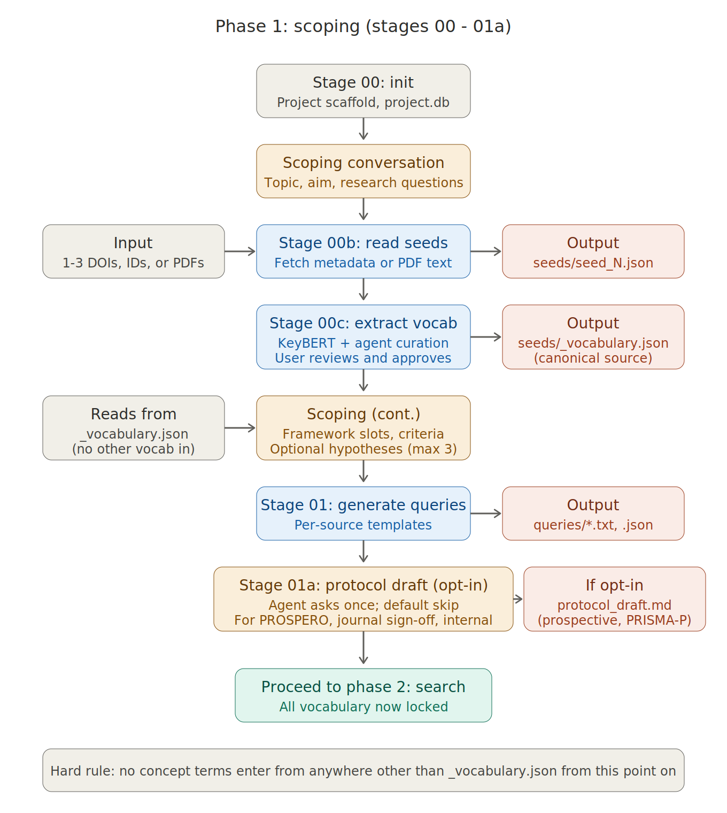
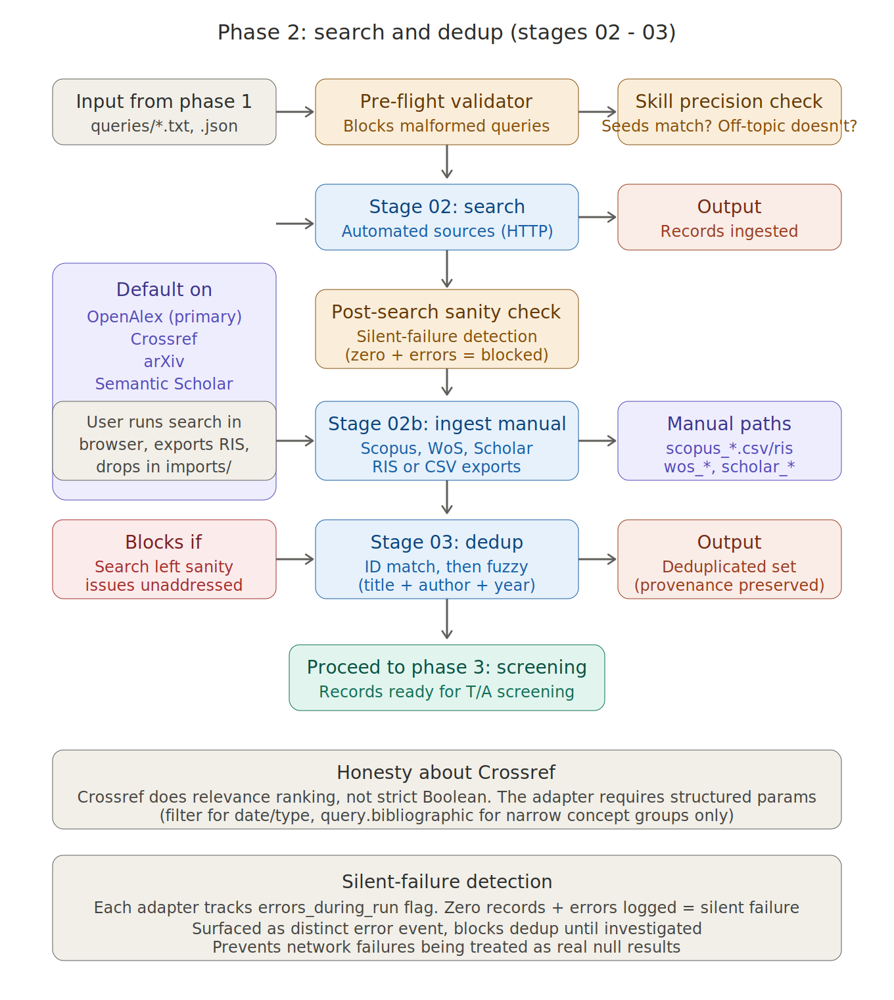
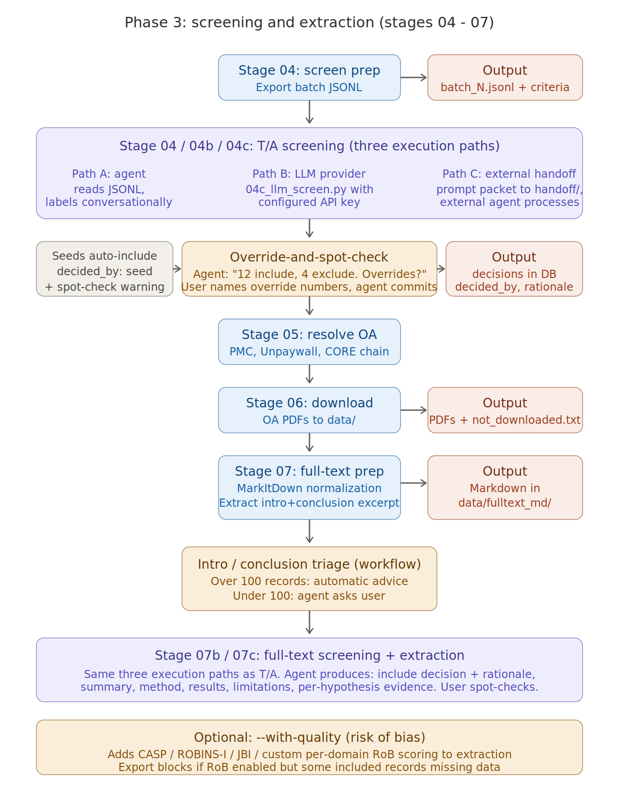
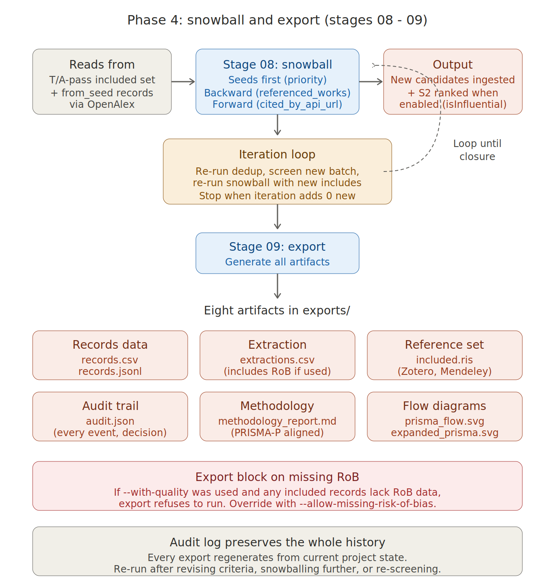

# SLR-Engine review process (detailed walkthrough)

## Overview

A complete walkthrough of every step a user goes through when running a review with SLR-Engine. The [introduction guide](introduction-to-slr-engine.md) gives the high-level shape.

The engine has roughly twenty steps when you count substages. Most of them are quick. A few of them are where you'll spend real attention. This document marks which is which.

**Two discovery paths exist.** This document follows the **keyword-search path** (seeds → vocabulary → queries → search → screen → full text → export). SLR-Engine also supports **pearl growing** (seeds → vocabulary → screen → snowball → loop dedup/screen before or alongside search). See [Alternative path: pearl growing](#alternative-path-pearl-growing) near the end.

---

## Before anything starts

You need three things in place:

- **The engine installed.** Python 3.11+ is what CI tests; core dependency is PyYAML (`pip install -r requirements.txt`). Optional extras: `keybert` + `sentence-transformers` (better vocabulary at 00c), `markitdown` + PDF libs (full-text conversion at 07).
- **A coding agent with the skill loaded.** The agent needs network access (metadata APIs, OA downloads) and the ability to run Python scripts on your machine. The skill file (`skills/slr-engine/SKILL.md`) goes in your agent's skill directory. Once installed, the agent picks it up when you signal review intent.
- **A topic in mind.** Doesn't need to be polished — the agent helps you sharpen it.

### API keys and optional sources (read this once)

**Nothing is required to start.** The default setup uses your **coding agent** for judgment steps (vocabulary curation, screening, full-text reading). Python scripts handle search, dedup, OA resolve, download, and export.

Copy `.env.example` to `.env` and fill only what you use. Keys can also live in `project.yaml` where noted.

| Key / setting | Stage | What it does | Required? |
|---------------|-------|--------------|-----------|
| *(none)* | 02 | OpenAlex, Crossref, arXiv, Semantic Scholar work without keys at modest volume | No |
| `OPENALEX_API_KEY` or `openalex_api_key` in `project.yaml` | 02, 05 | Avoids HTTP 400 on long Boolean OpenAlex queries; auth on OpenAlex OA lookups | Recommended for complex queries |
| `S2_API_KEY` | 02, 08 | Semantic Scholar — works without a key; key improves rate limits and snowball edge ranking when S2 is enabled | No |
| `NCBI_API_KEY` or `pubmed_api_key` in `project.yaml` | 02 | PubMed — only if `sources.pubmed: true` | No (helps rate limits) |
| `contact_email` in `project.yaml` | 05–06 | Unpaywall polite-pool identification (not an env var) | Yes for reliable OA resolve |
| `CORE_API_KEY` + `sources.core: true` | 05 | Extra OA resolver mirror (CORE) | No |
| `ANTHROPIC_API_KEY` / `DEEPSEEK_API_KEY` / `GOOGLE_API_KEY` | 00c, 04c, 07c, 08b | **Unattended LLM path only** — see below | No (default is agent mode) |

**Agent mode vs API-backed judgment (important):**

- **Default — agent mode** (`llm:` absent, or `provider: agent`): Scripts **do not** call Anthropic/DeepSeek/Google for screening or vocabulary. Instead they run deterministic steps (KeyBERT, search, dedup, etc.) and write **handoff files** under `projects/<id>/` — e.g. `seeds/_vocabulary_agent_request.md`, `screening/batch_NNN_agent_request.md`, `screening/*_prompts.jsonl`. Your coding agent reads those files, does the judgment work, and commits results. This is the **intended** workflow.
- **Optional — unattended LLM path** (`llm.provider: anthropic|deepseek|google` in `project.yaml` + matching key in `.env`): Pipeline stages call `slr_engine/llm.py` directly. Secondary to agent + operator skill. `agent_handoff_runner.py` validates external harness outputs if you split work across sessions.

**Toggle optional search sources** in `project.yaml` under `sources:` — e.g. PubMed, Europe PMC, DBLP, Internet Archive Scholar. Defaults: OpenAlex, Crossref, arXiv, and Semantic Scholar on; PubMed and grey-literature sources off unless you enable them.

---

## Starting a review

Open your coding agent and say something like *"help me start a literature review on [your topic]."* The skill triggers and the conversation begins.

You can stop at any point. State is saved to disk between stages (`project.yaml`, `project.db`, JSONL batches under `screening/`). Resume with *"continue my review on [topic]"* or *"resume project [id]"*.

---

## Scoping and project setup

[](../assets/review-process/phase1-scoping.png)

### Stage 00 — Initialize the project

- **Engine:** creates `projects/<your-review-id>/` with `project.yaml`, `project.db`, and folders for `queries/`, `imports/`, `screening/`, `data/fulltext/`, `data/fulltext_md/`, `exports/`, and `logs/`. The `seeds/` folder appears when you run 00b.
- **You:** confirm the review ID (short slug) and topic. Agent proposes; you approve.
- **Time:** under a minute.
- **Output:** empty project skeleton on disk.

---

### Scoping conversation — topic, aim, research questions

- **Engine:** nothing yet. This is conversational.
- **You:** work through topic, aim, and research questions (usually one to three). One or two questions at a time, not a form.
- **Time:** 10–20 minutes (longer if the topic needs work).
- **Output:** scoping fields in `project.yaml`.

---

### Stage 00b — Read your seeds

- **Engine:** fetches metadata for up to three anchor papers (OpenAlex/Crossref for DOIs; local PDF text extraction for files).
- **You:** provide seeds as DOI, OpenAlex ID (`W…`), or path to a PDF. At least one required. More than three → first three kept, rest dropped with a message.
- **Time:** minutes if you have papers; longer if you need to find them.
- **Output:** `seeds/seed_*.json` per seed; each seed ingested into `project.db` with `from_seed=1`.

---

### Stage 00c — Extract vocabulary

- **Engine:** KeyBERT (if installed) extracts ~30–50 distinctive phrases from seed text; without KeyBERT, a weaker frequency fallback runs. In agent mode, saves `_keybert_bucket.json` and a prompt packet; your agent writes `seeds/_vocabulary.json`. With `llm:` configured, the script can call the API instead.
- **You:** review `_vocabulary.json` — add/remove terms, adjust clusters.
- **Time:** 10–20 minutes of review.
- **Output:** `seeds/_vocabulary.json` — canonical terms for queries and framework slots.

---

### Scoping continued — framework, hypotheses, criteria

- **You:** still conversational — framework slots (PICOC by default; SPIDER/SPICE or custom), optional hypotheses (up to three), eligibility criteria with IDs (I1, E1, …), date range, languages, target result count.
- **Time:** 20–30 minutes.
- **Output:** more fields in `project.yaml`.

---

## Queries, search, and deduplication

[](../assets/review-process/phase2-search-dedup.png)

### Stage 01 — Generate query templates

- **Engine:** scaffolds `queries/` files per enabled source (OpenAlex `.txt`, Crossref `.json`, PubMed `.txt`, arXiv `.txt`, etc.).
- **You:** agent fills literals from vocabulary; you approve literal strings and API URLs before search.
- **Output:** query files in `projects/<id>/queries/`.

---

### Stage 01a — Protocol draft (optional)

- **Agent asks:** whether you want a prospective `protocol_draft.md` (PRISMA-P-style) before search. Most internal/KM reviews skip; you still get a retrospective `methodology_report.md` at export.
- **Output (if yes):** `projects/<id>/protocol_draft.md`.

---

### Stage 02 — Search

- **Engine:** runs enabled API sources. Pre-flight **query validation** blocks structural errors. Post-search **sanity check** flags silent zeros, extreme totals, asymmetric coverage. Blocking issues require fixing queries or passing `--acknowledge-warnings`.
- **Agent (before run):** precision check — do seeds match? Are obvious off-topic titles excluded?
- **You:** approve literals; review per-source counts after run.
- **Output:** records in `project.db` with source provenance; `logs/search.log`.

---

### Stage 02b — Manual import (optional)

- **Engine:** ingests `imports/scopus_*`, `wos_*`, `scholar_*` (RIS/CSV/txt).
- **Output:** additional records tagged `scopus`, `web_of_science`, or `google_scholar_manual` — not a generic `_manual` tag.

---

### Stage 03 — Deduplicate

- **Engine:** identifier dedup at insert time, then fuzzy title+author+year. Blocks if unacknowledged search errors exist; blocks re-dedup after screening unless `--force`.
- **Output:** deduplicated corpus in `project.db` with `dedup_log`.

---

## Screening, open access, and full text

[](../assets/review-process/phase3-screening-extraction.png)

*Diagram note:* agent handoff files live under `screening/` (not a `handoff/` folder); paywalled includes are listed in `screening/not_downloaded.csv` and `.txt`.

### Stage 04 — Title and abstract screening

- **Engine:** exports up to **5 records per batch** (hard cap — not 50) to `screening/batch_NNN.jsonl` plus refreshed `screening/_criteria.md`.
- **You:** agent labels each line (`include` / `exclude` / `unsure`, reason, `criteria_hit`), you spot-check, then `04b_screen_commit.py` runs. Optional LLM path: `04c_llm_screen.py` with `llm:` configured. Seeds **auto-include** on first T/A commit (`decided_by=seed`) — spot-check them.
- **Time:** scales with corpus size; batches of 5 mean many round-trips for large sets.
- **Output:** decisions in SQLite `screening` table (`decided_by`: `agent`, `human`, `seed`, or `llm:<provider>`).

---

### Stage 05 — Resolve open access

- **Engine:** for T/A `include` records, ranks OA candidates: **PMC → Europe PMC → OpenAlex → Unpaywall → arXiv → CORE (if enabled) → Crossref**. Only gold/green/bronze tiers; hybrid/closed skipped.
- **Output:** `oa_url`, `oa_status`, `license` on `records`; download rows in `downloads` table (`resolved` / `queued`).

---

### Stage 06 — Download

- **Engine:** fetches OA files to `projects/<id>/data/fulltext/` (PDF/HTML/XML). Retries alternates from the resolve queue.
- **You:** can drop manually acquired PDFs into `data/fulltext/` for the next stage.
- **Output:** files under `data/fulltext/`; paywalled includes listed in `screening/not_downloaded.csv` and `screening/not_downloaded.txt`.

---

### Stage 07 — Full-text prep

- **Engine:** converts downloads to Markdown (`data/fulltext_md/`), builds excerpts, writes `screening/ft_batch_NNN.jsonl` (max **5** records per batch).
- **Output:** markdown sidecars + full-text batch files.

---

### Intro/conclusion triage (optional agent workflow)

- **What:** optional pass using each row's `intro_conclusion_excerpt` before a full read.
- **When:** agent judgment, not a separate script stage. No enforced >100 threshold in code — prep batches are capped at 5.
- **Output:** same commit path as full-text screening when you proceed.

---

### Stage 07b — Full-text screening (default agent path)

- **Engine:** provides `ft_batch_*.jsonl` with `fulltext_excerpt`, `markdown_path`, criteria.
- **You:** agent reads full text, recommends include/exclude, you spot-check, commit via `07b_fulltext_commit.py`.
- **Persisted:** screening decisions only (`pass=full_text`). Structured extraction and hypothesis assessments are **not** written to the database on this path — use 07c or notes elsewhere.
- **Time:** usually the biggest time sink.

---

### Stage 07c — LLM full-text + extraction (optional)

- **When:** `llm.provider` set in `project.yaml` (not agent mode).
- **Engine:** combined screen + structured extraction in one API call per record. `07d_human_review.py` for final human commit. `--with-quality` adds risk-of-bias fields.
- **Output:** `extractions` table rows + `extractions.csv` at export.

---

### Risk of bias (08b / 08c, or 07c `--with-quality`)

- **What:** PRISMA-oriented critical appraisal (CASP, ROBINS-I, domain rubric, etc. — agent picks via `skills/slr-engine/SKILL_quality_assessment.md`).
- **Paths:** during 07c (`--with-quality`); after screening (`08b` → `08c`); agent mode (`quality_batch_*.jsonl` + prompt packets).
- **Export:** `09_export.py` **blocks** if any final included record lacks `risk_of_bias_overall` in `extractions`, unless you pass `--allow-missing-risk-of-bias`. Missing data alone triggers it — not whether you "enabled" RoB earlier.

```bash
python scripts/09_export.py --project <id> --allow-missing-risk-of-bias
```

- **Output:** RoB columns in `extractions.csv` when present.

---

## Snowball and export

[](../assets/review-process/phase4-snowball-export.png)

### Stage 08 — Snowball

- **Engine:** backward references + forward citations via OpenAlex; Semantic Scholar ranks edges when enabled. New records need dedup (03) and screening (04) again. Closure when T/A include+unsure count stops growing between iterations.
- **Note:** in pearl-growing workflows, snowball may run **before** stages 05–07.
- **Output:** new unscreened records; snowball events in audit log.

---

### Stage 09 — Export

Eight artifacts in `projects/<id>/exports/`:

| File | Notes |
|------|--------|
| `records.csv` / `records.jsonl` | All records + decisions |
| `included.ris` | Final includes for Zotero/Mendeley |
| `extractions.csv` | Only if extraction rows exist |
| `audit.json` | Queries, dedup, screening counts, events |
| `methodology_report.md` | **Retrospective** methods report |
| `prisma_flow.svg` | PRISMA 2020 flow |
| `expanded_prisma.svg` | Engine-specific detail |

(`protocol_draft.md` at project root is prospective PRISMA-P-style, generated only if you opted in at 01a.)

---

## Working across sessions

### What happens between sessions

- Stop anywhere — state stays on disk: `project.yaml`, `project.db`, `screening/*.jsonl`, `data/fulltext/`, logs.
- Resume with *"continue my review on [topic]"* or *"resume project [id]"* — the skill reads the folder and proposes the next script.

### What stages are time-heavy vs. fast

- **Quick (<10 min):** 00, 00b (seeds ready), 01, 02, 03, 05, 09 (if not blocked)
- **Medium (10–30 min):** scoping, 00c vocabulary review, 01a if opted in, 07 prep
- **Heavy (multiple sessions):** 02b manual imports, 04 T/A screening, 06 downloads, 07b full-text, 08 snowball loops

### What you can revise mid-review

- **Criteria** — edit `project.yaml`; refresh `_criteria.md` on next screen prep. Prior commits stand.
- **Vocabulary** — edit `_vocabulary.json`; re-run 01 and 02.
- **Queries** — edit `queries/*`; re-run 02.
- **Seeds** — add in `project.yaml`; re-run 00b and 00c.

### What can go wrong

- **No seeds** — 00b exits (intentional).
- **Silent zero from a source** — fix query or `--acknowledge-warnings` before dedup.
- **Huge result set** — sanity check warns; narrow queries.
- **Seed wouldn't pass your criteria** — criteria may be too narrow; fix in scoping.
- **Export blocked on RoB** — run 08b, use 07c `--with-quality`, or `--allow-missing-risk-of-bias`.

---

## Alternative path: pearl growing

When Boolean search is weak but you have good anchor papers:

1. `00b` seeds → `00c` vocabulary
2. `04` screen (seeds auto-include)
3. `08` snowball → `03` dedup → `04` screen new hits → repeat `08` until closure
4. Optionally add `01`/`02` keyword search in parallel
5. Shared tail: `05` → `06` → `07` → (`08b` if RoB) → `09`

---

## What you have at the end

- Eight export files in `projects/<id>/exports/` (see Stage 09).
- Optional `protocol_draft.md` at project root if you opted in at **01a**.
- A defensible included set with provenance, PRISMA diagrams, and a retrospective methodology report.
- Optional structured extractions if you used **07c**.
- **Synthesis** (the narrative interpreting findings) is still your work.
